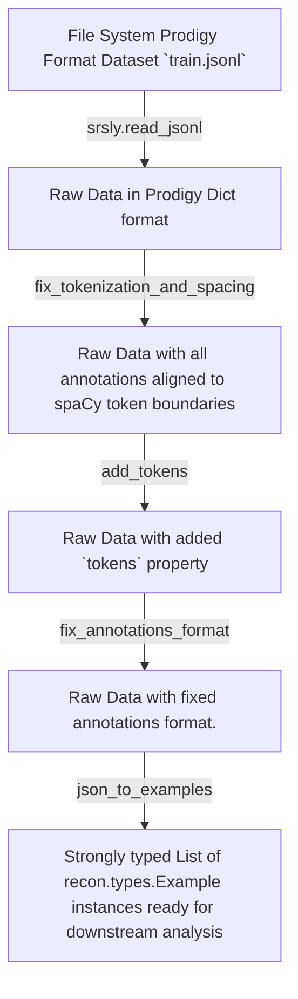

# Loading your data

ReconNER expects your data to be in the most basic [Prodigy Annotation Format](https://prodi.gy/docs/api-interfaces#ner).

A single example in this format looks like:

```JSON
{
  "text": "Apple updates its analytics service with new metrics",
  "spans": [{ "start": 0, "end": 5, "label": "ORG" }]
}
```

ReconNER does require that you have the tokens property set and will try to resolve any tokenization errors in your
data for you. If your have already been tokenized (which is true if you used the ner_manual Prodigy recipe), ReconNER
will skip the tokenization step.

ReconNER expects your data to be in a collection in the `.jsonl` File Format.

## Load Corpus from_disk

There are several utilities available for loading your data.


The easiest way to load your data is to initialize a [Corpus](../api/corpus.md) from disk.
If you have a train/dev/test split or just train/dev files in the same directory, it's as easy as calling the `from_disk` `classmethod` for the `Corpus` object.

```Python
corpus = Corpus.from_disk('path/to/data_dir')
```

`Corpus.from_disk` will look in the `data_dir` you provide for a file structure that looks like:

```
data_dir
│   train.jsonl
│   dev.jsonl
│   test.jsonl
```

!!! tip
    The test.jsonl file is **optional** but generally you should split your annotated data into train/dev/test files.

## The Process of Loading Data

While it's recommended to load data using the `Corpus.from_disk` method, you can also load data directly from disk using the `loaders.read_jsonl` and `loaders.read_json` functions.

These functions expect the same example format (in fact, the `Corpus.from_disk` runs `loaders.read_jsonl` function) and run a few steps.

The default pipeline that ReconNER runs when you load data is the following:



### 1. Read data from disk
Loads your data with <a href="https://github.com/explosion/srsly" class="external-link" target="_blank">srsly</a> using `srsly.read_jsonl` or `srsly.read_json`

### 2. Fix Tokenization and Spacing
Fixes all annotations that are not aligned to spaCy token boundaries if possible. If examples cannot easily be fixed, the default behavior is to remove these
examples. This should rarely be the case and if this function cannot correct the Example it was likely a bad example that would confuse your model anyway.

### 3. Add Tokens
The previous step computes token boundaries but then can alter the text of some examples to fix spacing and tokenization issues.
In this step we rerun the spaCy tokenizer and add a tokens property to the data inline with the Prodigy format.

### 4. Fix Annotation Format
Fixes some common issues in Annotation formatting that can arise using the [`validation.fix_annotations_format`](../../api/validation/#fix_annotations_format)

### 5. Filter Overlapping Entities
Often, you'll find your data has overlapping entities. For instance, imagine you have 2 annotators and one decided "Tesla" is a `PRODUCT` and the other noticed that the sentence is actually about "Tesla Motors" which they label as an `ORG`. This function does it's best to resolve these overlaps and in the case above would select "Tesla Motors" `ORG` as the correct entity, deleting "Tesla" `PRODUCT` from the data [`validation.filter_overlaps`](../../api/validation/#filter_overlaps)

### 6. Load into ReconNER type system

Finally these loaders will take a list of JSON examples in the Prodigy Annotation Format outlined above and convert it into a list of `Example` models using <a href="https://pydantic-docs.helpmanual.io/" class="external-link" target="_blank">Pydantic</a>

## Next Steps

Once you have your data loaded, you can run other ReconNER functions on top of it to gain insights into the quality and completeness of your NER data
